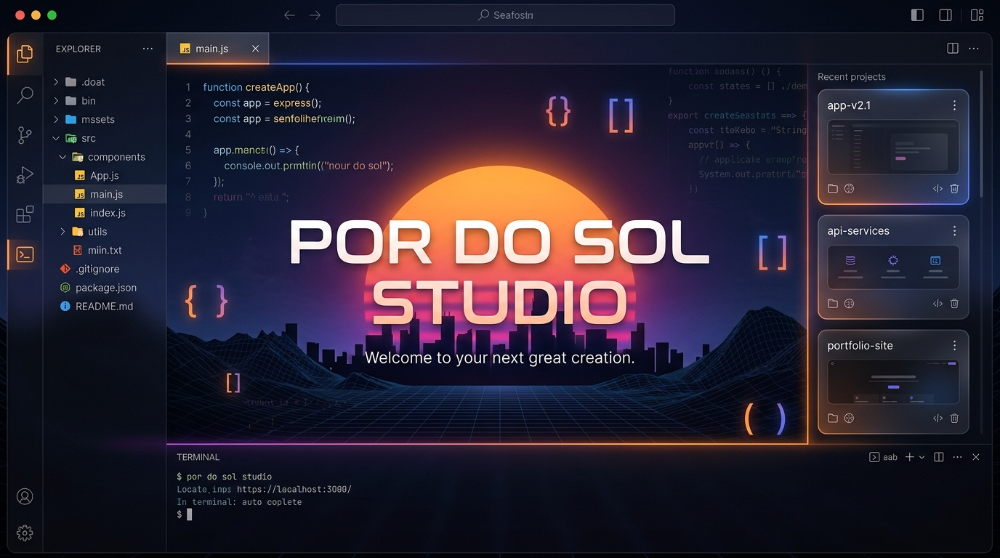
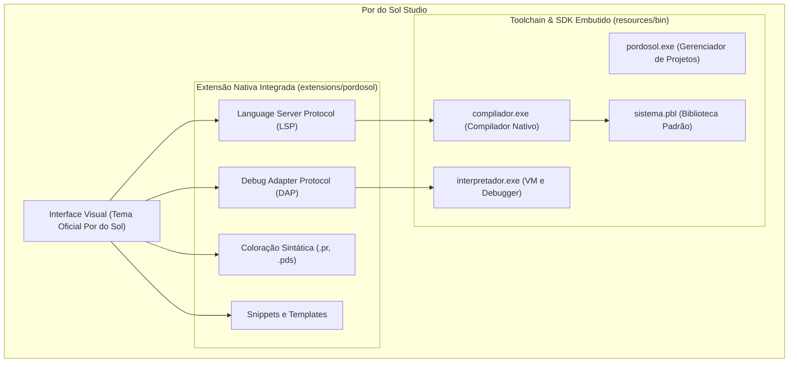

# 🌅 Por do Sol Studio - IDE Oficial da Linguagem Por do Sol

<p align="center">
  
</p>

<p align="center">
  <strong>O Ambiente de Desenvolvimento Oficial, Moderno e Integrado da Linguagem de Programação Por do Sol</strong>
</p>

<p align="center">
  <a href="#-sobre-a-linguagem-por-do-sol">Sobre a Linguagem</a> •
  <a href="#-recursos-da-ide-oficial">Recursos da IDE</a> •
  <a href="#-semântica-e-sintaxe">Sintaxe & Semântica</a> •
  <a href="#-sdk-e-ferramentas-embutidas">SDK Embutido</a> •
  <a href="#-atalhos-e-produtividade">Atalhos</a> •
  <a href="#-construção-e-execução">Como Construir</a>
</p>

---

## 💡 Sobre a Linguagem Por do Sol

A **Por do Sol** é uma linguagem de programação moderna totalmente em português brasileiro, criada com o mesmo modelo mental, produtividade e robustez de linguagens como **C#**.

A proposta não é apenas traduzir comandos soltos, mas construir uma linguagem de alta performance com tipagem estática forte, orientação a objetos completa e múltiplos alvos de compilação reais (**LLVM IR**, **.NET/CIL** e **Bytecode** próprio).

### Pilares Fundamentais:
- 🇧🇷 **Português Primeiro:** Palavras-chave, tipos, mensagens de erro e biblioteca padrão projetados em português brasileiro.
- 🎯 **Semântica e Familiaridade com C#:** Classes, interfaces, herança, polimorfismo, propriedades, inferência local (`var`), async/await e tipos de valor vs. referência.
- ⚡ **Compilação Real e Múltiplos Alvos:**
  - **LLVM IR (`.ll`):** Compilação nativa de alta performance via LLVM / Clang.
  - **.NET / CIL (`.il`):** Integração com o ecossistema .NET.
  - **Bytecode (`.pbc`):** Execução portátil e depuração interativa na Máquina Virtual nativa.
- 🛡️ **Tipagem Estática Forte & Segurança de Tipos:** Validação rigorosa em tempo de compilação e suporte a generics.

---

## 🖥️ Recursos da IDE Oficial (Por do Sol Studio)

O **Por do Sol Studio** é construído sobre a base do Visual Studio Code (Code-OSS), trazendo todo o ecossistema da linguagem pré-instalado e integrado de forma nativa:



- 🎨 **Experiência Visual Oficial:** Ícones de arquivo `.pr`, branding customizado e tela inicial (Welcome Page) dedicada.
- 🔍 **Language Server (LSP) em Tempo Real:**
  - Autocompletar inteligente para classes, funções, variáveis e métodos.
  - Diagnóstico de erros semânticos com sublinhado em tempo real.
  - Informações de tipo ao passar o mouse (*hover type hints*).
  - Ir para a definição (*Go to Definition*).
- 🐞 **Depuração Nativa com F5:**
  - Pontos de interrupção (breakpoints).
  - Painel de inspeção de variáveis locais e globais.
  - Execução passo a passo (*Step Over*, *Step Into*, *Step Out*).
- 📦 **Zero Configuração ("Out-of-the-Box"):** O compilador, interpretador, CLI e biblioteca padrão já vêm embutidos nos recursos da IDE. Não é necessário configurar variáveis de ambiente manualmente.

---

## 📜 Semântica e Sintaxe da Linguagem

### Exemplo Completo: Orientação a Objetos & Herança

```csharp
espaco MeuPrograma;

usando Sistema;

interface IImprimivel {
    funcao Imprimir() -> vazio;
}

classe Pessoa : IImprimivel {
    publico texto Nome { obter; definir; }
    publico inteiro Idade { obter; definir; }

    publico Pessoa(texto nome, inteiro idade) {
        este.Nome = nome;
        este.Idade = idade;
    }

    publico redefinivel funcao Apresentar() -> texto {
        retorne $"Olá, meu nome é {este.Nome} e tenho {este.Idade} anos.";
    }

    publico funcao Imprimir() -> vazio {
        Console.EscreverLinha(este.Apresentar());
    }
}

classe Desenvolvedor : Pessoa {
    publico texto LinguagemFavorita { obter; definir; }

    publico Desenvolvedor(texto nome, inteiro idade, texto linguagem) : base(nome, idade) {
        este.LinguagemFavorita = linguagem;
    }

    publico sobrescreve funcao Apresentar() -> texto {
        retorne $"{base.Apresentar()} Eu programo em {este.LinguagemFavorita}!";
    }
}

classe ProgramaPrincipal {
    publico estatica funcao Principal() -> vazio {
        var dev = novo Desenvolvedor("Adriano", 28, "Por do Sol");
        dev.Imprimir();
    }
}
```

### Palavras-Chave e Tipos Fundamentais:

| Categoria | Termos em Por do Sol |
| :--- | :--- |
| **Estrutura** | `espaco`, `usando`, `classe`, `interface`, `enumeração`, `estrutura` |
| **Visibilidade** | `publico`, `privado`, `protegido`, `estática`, `abstrata` |
| **Polimorfismo** | `redefinível`, `sobrescreve`, `base`, `este`, `novo`, `nova` |
| **Tipos de Valor** | `inteiro`, `texto`, `booleano`, `flutuante`, `duplo`, `decimal`, `vazio` |
| **Controle de Fluxo** | `se`, `senão`, `enquanto`, `para`, `escolha`, `caso`, `retorne`, `pare` |
| **Assincronismo** | `assíncrona`, `aguarde` |
| **Inclusão / Variáveis**| `var`, `verdadeiro`, `falso`, `nulo` |

---

## ⌨️ Atalhos e Produtividade

| Atalho | Ação no Por do Sol Studio |
| :--- | :--- |
| <kbd>F5</kbd> | Iniciar Execução com Depuração (Modo Debug) |
| <kbd>Ctrl</kbd> + <kbd>F5</kbd> | Executar Programa sem Depuração |
| <kbd>Ctrl</kbd> + <kbd>Shift</kbd> + <kbd>B</kbd> | Compilar Projeto / Arquivo Atual |
| <kbd>F9</kbd> | Inserir / Remover Ponto de Interrupção (Breakpoint) |
| <kbd>F10</kbd> | Avançar Linha (Step Over) |
| <kbd>F11</kbd> | Entrar na Função (Step Into) |
| <kbd>Shift</kbd> + <kbd>F11</kbd> | Sair da Função (Step Out) |

---

## 🛠️ Como Construir e Desenvolver a IDE

### Pré-requisitos:
- **Node.js** (v20+ recomendado) e **npm**
- **Rust / Cargo** (para compilar o compilador nativo caso queira alterar o backend)
- **Git**

### 1. Sincronizar SDK e Assets Visuais
Para compilar e integrar o compilador, interpretador e ícones:

```powershell
.\scripts\build-ide.ps1 -Version "0.1.5"
```

No Linux / macOS:
```bash
chmod +x ./scripts/build-ide.sh
./scripts/build-ide.sh "0.1.5"
```

### 2. Executar a IDE em Modo de Desenvolvimento
```powershell
npm install
npm run watch
# Em outro terminal:
.\scripts\code.bat
```

---

## 🌐 Repositórios do Ecossistema Por do Sol

- 🌅 **IDE Oficial:** [Adriano-Severino/pordosol-studio](https://github.com/Adriano-Severino/pordosol-studio)
- ⚡ **Compilador e Interpretador:** [Adriano-Severino/compilador-portugues](https://github.com/Adriano-Severino/compilador-portugues)
- 📦 **SDK e Ferramenta CLI:** [Adriano-Severino/ferramentas-cli](https://github.com/Adriano-Severino/ferramentas-cli)
- 📚 **Biblioteca Padrão:** [Adriano-Severino/sistema-padrao](https://github.com/Adriano-Severino/sistema-padrao)
- 🧩 **Servidor de Linguagem (LSP):** [Adriano-Severino/pordosol-language-server](https://github.com/Adriano-Severino/pordosol-language-server)

---

## 📄 Licença

Distribuído sob a licença **MIT**. Consulte `LICENSE.txt` para mais informações.
